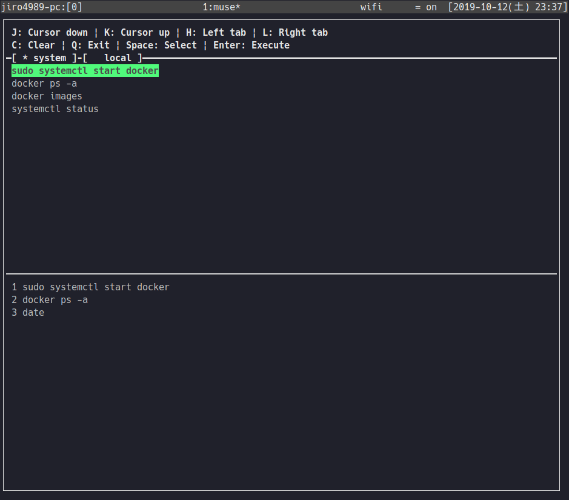

= muse
:toc: left
:sectnums:

The simple CLI tool to select commands on TUI and execute sequentially.

== Development

Nim v1.0.0

== Usage

Run below.

[source,bash]
----
muse exec
----

At first, `muse` displays default commands.
Commands file was created at `$HOME/.config/muse/commands.json` when you run
`muse exec`.

Next, you run below.

[source,bash]
----
muse edit
----

Open `commands.json` with your editor on Environment variables `EDITOR`.
You edit the commands, and save the file.

And you re-run `muse exec`.

== Install

[source,bash]
----
nimble install https://github.com/jiro4989/muse
----

== LICENSE

MIT

